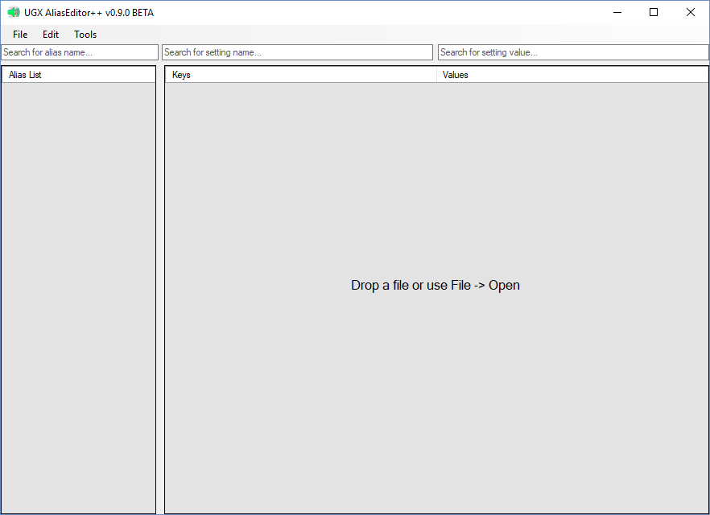

# AliasEditor++ v0.9.0 (Beta)

</img>

## Features
* You can open any soundalias csv with the program.
* All aliases in the opened file are  grouped by name in the left data column.
* You can find any soundalias setting within seconds using the Search for Setting Name feature.
* You can sort any column by name to make editing more intuitive.
* You can add, remove, and clear specific aliases in the opened file by using the Edit menu or by right-clicking the list of aliases.
* You can add sample 2d and 3d aliases of various types in the opened file by using the Add from Samples option in the Edit menu.
* You can base a new soundalias file off of an existing one by using the Save As feature.
* You can save changes to the currently opened soundalias by using the Save feature.
* You can create a new soundalias file by using the New feature.
* You can access all important features of the program with key combinations which are listed in each dropdown menu.
* All settings have tooltips which describe what the setting does.
* You can navigate to your root or root/raw/soundalises folder using the convenient buttons in the Tools menu.
* You will be notified if any updates are available to the application using the automatic update check upon launch of the program.

## Changelog
v0.8.0: First public release of the program. Beta Testing initiated.

v0.9.0: 
 - Added  "Samples" list to the Edit menu which you can use to insert a sample 2d, 2d streamed, 2d looping, 3d, and 3d looping alias to your file.
 - Opening a soundalias csv which only contains a header line are no longer "invalid files".
 - Added a right-click menu to the alias list which has the same functionality as the Edit menu.
 - Implemented the Duplicate, Clear, and Remove alias commands on the Edit and right-click menus.
 - Added key shortcuts for all of the edit commands.
 - Added a registry path fixer to the Tools menu.
 - Added better CoDWaW registry handling - if your installation is not found the program will ask you to locate it instead of throwing an unhandled exception.
 - If the soundalias header has a skipped setting (",,"), it will show as "<null>".
